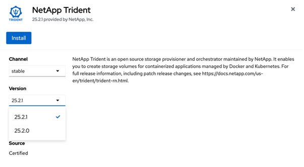

= OpenShift OperatorHub를 사용하여 Trident를 설치합니다
:hardbreaks:
:allow-uri-read: 
:icons: font
:imagesdir: ../media/

[role="lead"]
Red Hat OpenShift를 사용하는 경우 Red Hat 공인 운영자를 사용하여 NetApp Trident를 설치할 수 있습니다. 다음 절차를 사용하여 Red Hat OpenShift Container Platform에서 Trident를 설치합니다.

.시작하기 전에
설치를 시작하기 전에 link:../trident-get-started/requirements.html["Trident 설치 환경을 준비합니다"]를 참조하십시오.

== Trident 운영자를 찾아 설치합니다

.단계
. OpenShift OperatorHub로 이동하여 NetApp Trident를 검색합니다.
+
image::../media/openshift-operator-01.png[Trident 연산자]

. 설치 * 를 클릭합니다.
+

. 필요한 옵션을 선택하고 * 설치 * 를 클릭합니다.
+
image::../media/openshift-operator-03.png[설치합니다]

. 설치가 완료되면 운전자가 설치된 운영자 목록에 표시됩니다.
+
image::../media/openshift-operator-04.png[설치되어 있습니다]

. 오퍼레이터 번들 설치처럼 Torc를 생성합니다.

== Trident 운영자를 제거합니다

.단계
. 설치된 운영자 목록에서 Trident 운영자를 선택합니다.
+
image::../media/openshift-operator-05.png[설치합니다]

. 연산자에서 모든 피연산자 인스턴스를 삭제하려면 선택합니다.
+
image::../media/openshift-operator-06.png[설치되어 있습니다]

+

WARNING: 이 연산자에서 모든 피연산자 인스턴스 삭제 * 확인란을 선택하지 않으면 Trident가 제거되지 않습니다.

. 제거 * 를 클릭합니다.

