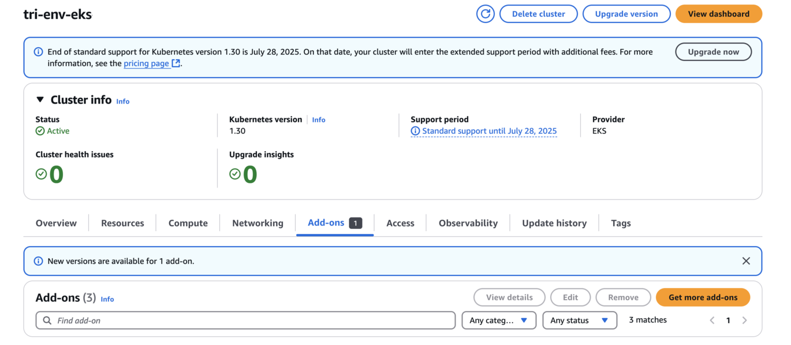

= EKS 클러스터에서 Trident EKS 애드온을 구성합니다
:hardbreaks:
:allow-uri-read: 
:icons: font
:imagesdir: ../media/

[role="lead"]
NetApp Trident은 Kubernetes에서 Amazon FSx for NetApp ONTAP 스토리지 관리를 간소화하여 개발자와 관리자가 애플리케이션 구축에 집중할 수 있도록 지원합니다. NetApp Trident EKS 애드온에는 최신 보안 패치 및 버그 수정이 포함되어 있으며 AWS에서 Amazon EKS와 함께 사용할 수 있다는 것이 검증되었습니다. EKS 애드온을 사용하면 Amazon EKS 클러스터의 보안과 안정성을 지속적으로 보장하고 애드온을 설치, 구성 및 업데이트하는 데 필요한 작업량을 줄일 수 있습니다.

== 필수 구성 요소

AWS EKS용 Trident 애드온을 구성하기 전에 다음 사항이 있는지 확인하십시오.

* 추가 기능을 사용할 수 있는 권한이 있는 Amazon EKS 클러스터 계정입니다. 을 link:https://docs.aws.amazon.com/eks/latest/userguide/eks-add-ons.html["Amazon EKS 애드온"^]참조하십시오.
* AWS 마켓플레이스에 대한 AWS 권한:
`"aws-marketplace:ViewSubscriptions",
"aws-marketplace:Subscribe",
"aws-marketplace:Unsubscribe`
* AMI 유형: Amazon Linux 2 (AL2_x86_64) 또는 Amazon Linux 2 Arm (AL2_ARM_64)
* 노드 유형: AMD 또는 ARM
* 기존 Amazon FSx for NetApp ONTAP 파일 시스템

== 단계

. EKS Pod에서 AWS 리소스에 액세스할 수 있도록 IAM 역할 및 AWS 암호를 생성하십시오. 자세한 내용은 을 link:../trident-use/trident-fsx-iam-role.html["IAM 역할 및 AWS Secret을 생성합니다"^]참조하십시오.
. EKS Kubernetes 클러스터에서 * Add-ons * 탭으로 이동합니다.
+

. AWS Marketplace 애드온 * 으로 이동하여 _STORAGE_CATEGORY를 선택합니다.
+
image::../media/aws-eks-02.png[AWS eks 02]

. NetApp Trident * 를 찾아 Trident 애드온의 확인란을 선택하고 * 다음 * 을 클릭합니다.
. 원하는 추가 기능 버전을 선택합니다.
+
image::../media/aws-eks-03.png[AWS eks 03]

. 노드에서 상속할 IAM 역할 옵션을 선택합니다.
+
image::../media/aws-eks-04.png[AWS eks 04]

. 추가 기능 구성 스키마 * 에 따라 * 구성 값 * 섹션의 구성 값 매개 변수를 이전 단계(1단계)에서 만든 역할 아른으로 설정합니다. 값은 다음 형식이어야 합니다.
+
[source, JSON]
----
{

  "cloudIdentity": "'eks.amazonaws.com/role-arn: <role ARN>'"

}
----
+

NOTE: 충돌 해결 방법으로 재정의 를 선택한 경우 기존 애드온에 대한 하나 이상의 설정을 Amazon EKS 애드온 설정으로 덮어쓸 수 있습니다. 이 옵션을 사용하지 않고 기존 설정과 충돌하는 경우 작업이 실패합니다. 결과 오류 메시지를 사용하여 충돌 문제를 해결할 수 있습니다. 이 옵션을 선택하기 전에 Amazon EKS 추가 기능이 자체 관리해야 하는 설정을 관리하지 않는지 확인하십시오.

+
image::../media/aws-eks-06.png[AWS eks 06]

NOTE: Pod Identity 연결을 사용하는 경우 이 단계를 건너뜁니다.

를 누릅니다

. Create * 를 선택합니다.
. 애드온의 상태가 _Active_인지 확인합니다.
+
image::../media/aws-eks-05.png[AWS eks 05]

. 다음 명령을 실행하여 Trident가 클러스터에 올바르게 설치되어 있는지 확인합니다.
+
[listing]
----
kubectl get pods -n trident
----
. 설치를 계속하고 스토리지 백엔드를 구성합니다. 자세한 내용은 을 link:../trident-use/trident-fsx-storage-backend.html["스토리지 백엔드를 구성합니다"^]참조하십시오.

== CLI를 사용하여 Trident EKS 애드온을 설치/제거합니다

.CLI를 사용하여 NetApp Trident EKS 추가 기능을 설치합니다.
다음 명령 예에서는 Trident EKS 추가 기능을 설치합니다(전용 버전 포함).
`eksctl create addon --cluster clusterName --name netapp_trident-operator --version v25.02.1-eksbuild.1`

.CLI를 사용하여 NetApp Trident EKS 애드온을 제거합니다.
다음 명령을 실행하면 Trident EKS 추가 기능이 제거됩니다.

[listing]
----
eksctl delete addon --cluster K8s-arm --name netapp_trident-operator
----